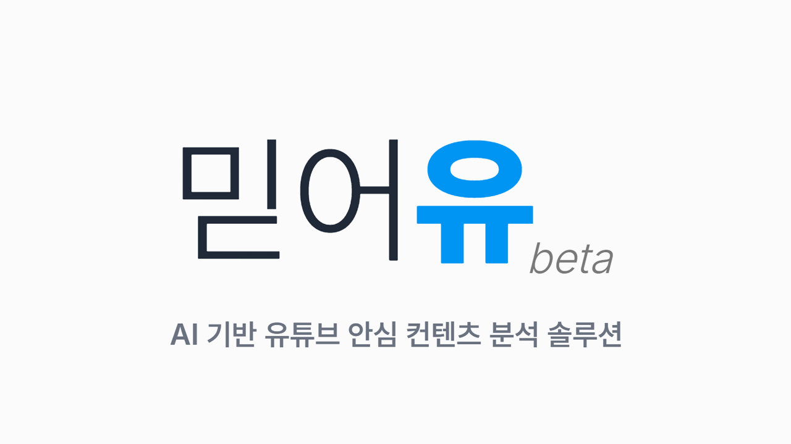

# 믿어유 (MeTheYou) Demo Client

## 주요 기능

- YouTube URL을 입력받아 AI 생성 콘텐츠 분석 요청
- 실시간 분석 진행 상황 표시
- 상세한 분석 결과 및 점수 표시

## 기술 스택

- **Frontend Framework**: React 18
- **Language**: TypeScript
- **Build Tool**: Vite
- **Routing**: React Router v7
- **HTTP Client**: Axios
- **Styling**: CSS

## 프로젝트 구조

```
src/
├── components/
│   ├── AnalyzeForm.tsx       # YouTube URL 입력 폼
│   ├── Header.tsx            # 헤더 컴포넌트
│   └── ResultsDisplay.tsx    # 분석 결과 표시 컴포넌트
├── services/
│   └── apiService.ts         # 백엔드 API 통신
├── assets/
│   └── images/               # 이미지 리소스
├── App.tsx                   # 메인 앱 컴포넌트
├── main.tsx                  # 애플리케이션 진입점
├── App.css                   # 전역 스타일
└── index.css                 # 기본 스타일
```

## 페이지 라우트

- `/` - 메인 페이지 (분석 폼)
- `/processing/:taskid` - 분석 진행 중 페이지
- `/done/:taskid` - 분석 완료 페이지

## 설치 및 실행

### 필수 요구사항
- Node.js 18 이상
- npm 또는 yarn

### 설치

```bash
# 의존성 설치
yarn install
```

### 개발 서버 실행

```bash
yarn dev
```

개발 서버는 기본적으로 `http://localhost:5173`에서 실행됩니다.

### 프로덕션 빌드

```bash
yarn build
```

최적화된 프로덕션 번들이 `dist/` 디렉토리에 생성됩니다.

### 빌드 미리보기

```bash
yarn preview
```

## 환경 변수 설정

`.env` 파일을 프로젝트 루트에 생성하여 API 엔드포인트를 설정하세요:

```
VITE_API_URL=http://your-api-server:8000
```

기본값은 `http://localhost:8000`입니다.

## API 명세

### 분석 요청
- **Endpoint**: `POST /ai_request.php`
- **Request Body**: `{ id: string }`
- **Response**: `{ taskid: string }`

### 작업 상태 조회
- **Endpoint**: `GET /ai_status.php?tid={taskid}`
- **Response**: `{ status: TaskStatus }`

### 분석 정보 조회
- **Endpoint**: `GET /ai_result.php?tid={taskid}`
- **Response**: `{ video_id, title, duration, channel_name, published_at, score, description, tags }`

## 분석 상태

| 상태 | 설명 |
|------|------|
| `ready` | 분석 준비 중 |
| `extract` | 영상 정보 추출 중 |
| `trans` | 자막 번역 중 |
| `analysis` | 분석 진행 중 |
| `saving` | 결과 저장 중 |
| `success` | 분석 완료 |
| `error` | 오류 발생 |
| `toolong` | 영상이 너무 긺 |

## 협력 기관

- **ETRI** (한국전자통신연구원)
- **ERICA** (한양대학교 ERICA캠퍼스)

## 라이선스

This project is part of the ERICA-ETRI Capstone 2025 program.
